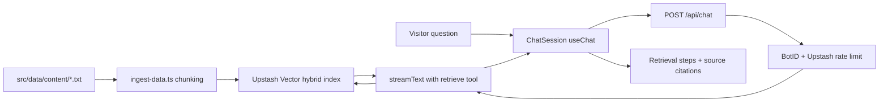

# Parker Van Ham — Portfolio Website

[](https://github.com/pvanham/portfolio-website/actions/workflows/ci.yml)

A modern, full-stack portfolio website with an AI-powered chatbot, contact form, and project showcase. Built to demonstrate professional work through an interactive, performant experience.

## Tech Stack

- **Framework:** Next.js 16 (App Router), React 19, TypeScript 5 (strict mode)
- **Styling:** Tailwind CSS 4
- **AI / RAG:** Vercel AI SDK, Upstash Vector (hybrid embeddings + BM25), OpenAI GPT-5.6 Luna
- **Rate Limiting:** Upstash Redis
- **Contact:** Resend + react-email for transactional emails
- **Validation:** Zod
- **Animation:** Motion (Framer Motion)

## Features

- **Homepage** — Interactive canvas hero, typewriter roles, project highlights, skills overview
- **Projects** — Dedicated `/projects/[slug]` pages with unique Open Graph previews
- **AI Chatbot** — RAG-based assistant powered by OpenAI GPT-5.6 Luna that answers questions about the portfolio using Upstash Vector hybrid retrieval and an agentic tool-calling pattern via the Vercel AI SDK
- **Contact Form** — Server action with Zod validation, Vercel BotID, honeypot, timing check, spam filtering, and Upstash rate limiting
- **Skills** — Dedicated page with structured content

## Architecture

This is a Next.js App Router application rather than a client-side React SPA because the site itself is the primary artifact recruiters evaluate.

- **Server-rendered metadata.** Titles, descriptions, canonical URLs, Open Graph tags, and per-route `opengraph-image` files are generated on the server so Slack, Teams, and LinkedIn unfurl a designed preview instead of a bare title.
- **Static project pages.** Each project is a statically generated `/projects/[slug]` route (`generateStaticParams`) so project links are shareable, indexable, and get their own OG image.
- **Server Actions for forms.** The contact form posts to a typed Server Action instead of a custom API route, keeping validation, BotID, rate limiting, and Resend delivery on the server.
- **Selective client JavaScript.** Pages stay Server Components. Client boundaries are limited to interactive pieces (navbar, chat, contact form, canvas, entrance animations). The chatbot and hero canvas are loaded with `next/dynamic` so they stay out of the initial bundle.
- **Tailwind CSS 4 tokens.** Color, radius, and font tokens live in `:root` and are mapped through `@theme inline` so components use semantic classes (`bg-background`, `text-primary`) instead of one-off hex values.
- **Accessibility as a first-class constraint.** Semantic landmarks, a skip link, a single page `<h1>`, keyboard-accessible project cards, and a chat panel that is a focus-trapped modal on mobile but a non-modal docked panel on desktop, so the page stays usable while it is open.

### RAG chatbot



The `retrieve` tool returns structured output (`{ context, sources }`) and uses `toModelOutput` to hand the model only the text, so the UI can render which sources an answer came from and link back to those pages without changing the prompt.

### Deployment

The site deploys on [Vercel](https://vercel.com). Pushes to GitHub trigger a production or preview build. Environment variables are stored in the Vercel project; GitHub Actions runs `typecheck`, `lint`, and `build` on every push and pull request.

## Project Structure

```
src/
├── app/              # Next.js App Router (pages, API routes, server actions)
├── components/       # Reusable UI (ui/, email/)
├── lib/              # Utilities, Upstash Vector client, constants
├── data/content/     # Plain-text RAG knowledge base (*.txt)
├── assets/           # Static images
└── scripts/          # Data ingestion for Upstash Vector
```

## Getting Started

### Prerequisites

- Node.js 18+
- npm

### 1. Clone and install

```bash
git clone https://github.com/pvanham/portfolio-website.git
cd portfolio-website
npm install
```

### 2. Environment variables

Copy the example file and fill in your keys:

```bash
cp .env.example .env.local
```

Required variables:

```env
# AI chatbot (OpenAI)
OPENAI_API_KEY=sk-...

# Upstash Vector (RAG retrieval)
UPSTASH_VECTOR_REST_URL=https://...
UPSTASH_VECTOR_REST_TOKEN=...

# Upstash Redis (chat rate limiting)
UPSTASH_REDIS_REST_URL=https://...
UPSTASH_REDIS_REST_TOKEN=...

# Contact form (Resend)
RESEND_API_KEY=re_...
```

### 3. RAG setup (Upstash Vector)

1. Create an [Upstash Vector](https://console.upstash.com/) index with built-in embedding support (e.g. `bge-small-en-v1.5`).
2. Create an [Upstash Redis](https://console.upstash.com/) database for rate limiting.
3. Add the credentials to `.env.local`.
4. Run the ingestion script to embed content from `src/data/content/*.txt`:

```bash
npm run ingest
```

To clear and re-ingest:

```bash
npm run ingest -- --clear
```

### 4. Run the dev server

```bash
npm run dev
```

Open [http://localhost:3000](http://localhost:3000).

## Scripts

| Command             | Description                            |
| ------------------- | -------------------------------------- |
| `npm run dev`       | Start development server               |
| `npm run build`     | Production build                       |
| `npm run start`     | Start production server                |
| `npm run lint`      | Run ESLint                             |
| `npm run typecheck` | TypeScript check (`tsc --noEmit`)      |
| `npm run ingest`    | Ingest RAG content into Upstash Vector |

## Updating the Chatbot Knowledge Base

Edit or add `.txt` files in `src/data/content/`. Current sources:

- `about_parker.txt`
- `skills.txt`
- `home.txt`
- `contact.txt`
- `Resume.txt`
- `project-buy-a-cnc-router.txt`
- `project-tee-time-bot.txt`
- `project-industrial-cnc-router-leads.txt`
- `project-sous.txt`
- `project-portfolio-website.txt`
- `project-z3-wellness.txt`
- `project-el-parque.txt`
- `project-hospital-system.txt`

After changing content, re-run the ingestion script.

## Lighthouse

Scores are measured against a production build (`npm run build && npm run start`), not the dev server.

| Category       | Mobile | Desktop |
| -------------- | ------ | ------- |
| Performance    | 83     | 95      |
| Accessibility  | 100    | 100     |
| Best Practices | 100    | 100     |
| SEO            | 100    | 100     |

## License

Private — all rights reserved.
